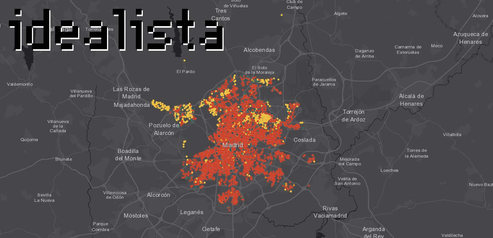

<h1 style="background:#C9FF35; border:0; color:black; padding-top:15px; padding-bottom:15px; text-align: center; font: normal 1rem/1.5rem 'bernino-regular',Verdana,Arial,Geneva,sans-serif !important; font-weight: 700 !important; font-size: 1.75rem !important; line-height: 2.25rem !important; letter-spacing: -0.00625rem !important; vertical-align: baseline !important;">Proyecto de Machine Learining y Deep Learning con datos de Idealista</h1>

